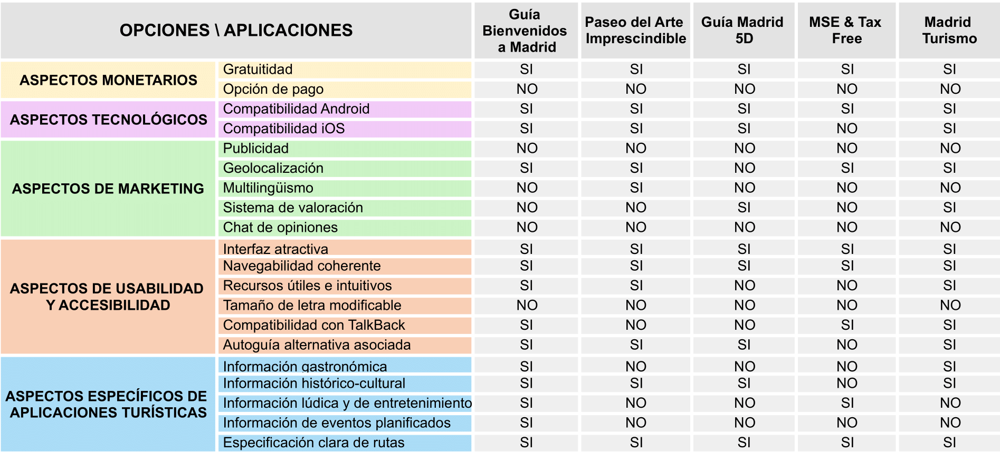
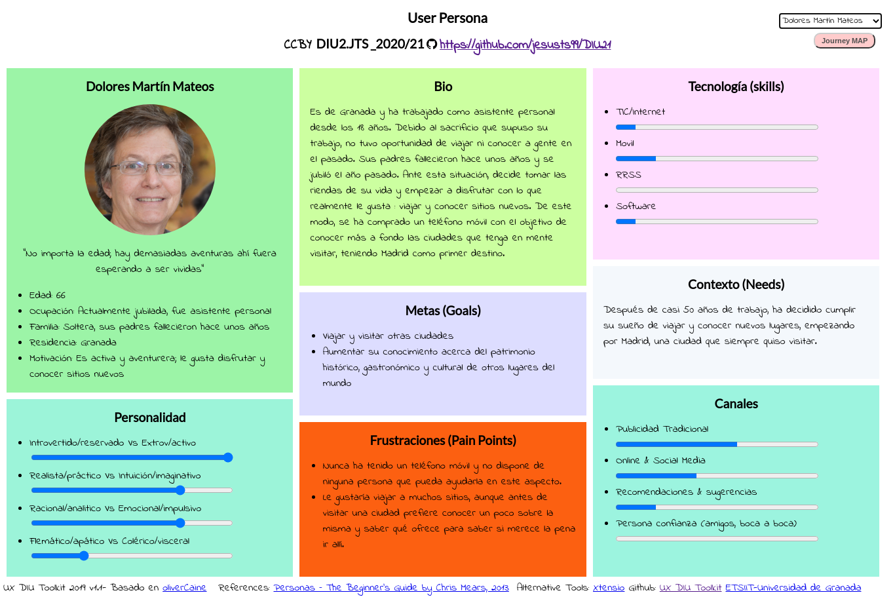
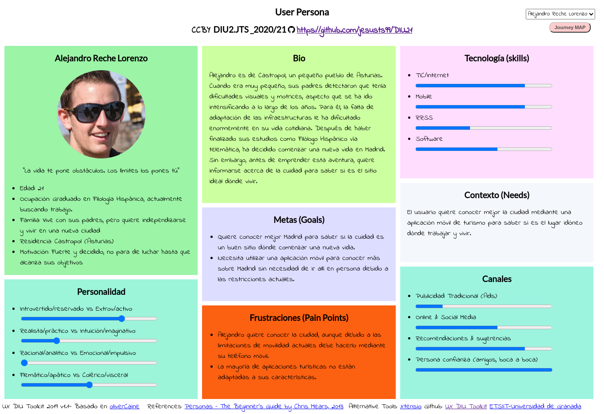
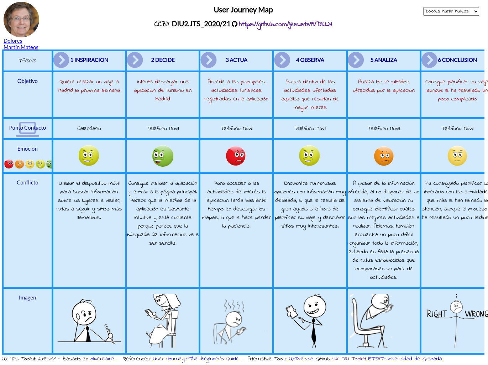
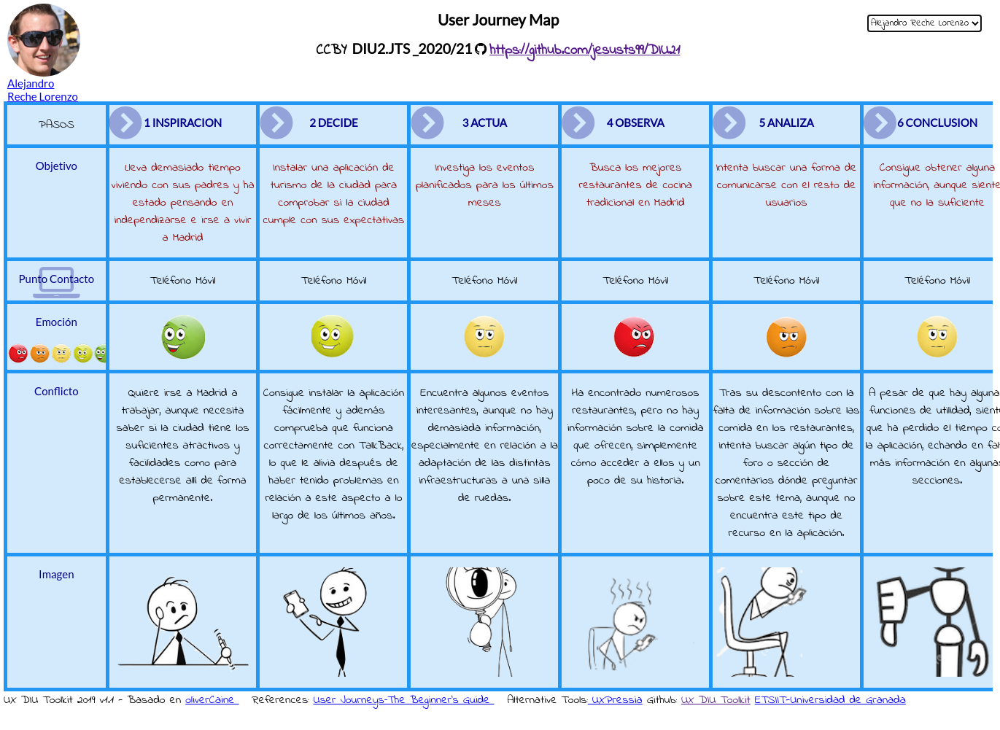

## Práctica 1. UX Desk Research & Analisis 

 1.a Competitive Analysis
-----

En este caso, se ha decidido centrar la búsqueda en un sector más específico como son las aplicaciones de turismo de la ciudad de Madrid. Dentro de las aplicaciones encontradas se pueden destacar las siguientes:

**Guía Bienvenidos a Madrid: https://apps.apple.com/es/app/gu%C3%ADa-bienvenidos-a-madrid/id632497903**

Esta aplicación fue creada por la Oficina de Turismo del Ayuntamiento de Madrid con el objetivo de recoger la información esencial para que cualquier turista pudiese preparar su viaje: zonas de interés, restaurantes, actividades de ocio, etc. 

**Paseo del Arte Imprescindible: https://www.esmadrid.com/app-paseo-arte-imprescindible**
    
Se trata de una aplicación dónde se recogen todas las obras de arte del Museo del Prado, el Museo Thyssen-Bornemisza y el Museo Reina Sofía. Gracias a esta app, los usuarios podrán conocer en profundidad las obras de forma amena y sencilla.

**Guía Madrid 5D: https://play.google.com/store/apps/details?id=com.jgdelval.rutando.madrid5d**

Esta aplicación recoge los principales atractivos turísticos de Madrid de una forma bastante atractiva e interactiva. Contiene una gran cantidad de rutas autoguiadas y además permite crear rutas personalizadas de forma fácil e intuitiva.

**MSE & Tax Free: https://play.google.com/store/apps/details?id=es.equmedia.Madiva&hl=es_419**

La aplicación permite a los usuarios encontrar numerosas tiendas, servicios y actividades en Madrid para poder planificar tu viaje. En ella se incluyen descripciones completas de cada servicio ofrecido.

**Madrid Turismo: https://play.google.com/store/apps/details?id=turpromadrid.principal&hl=es&gl=US**
	
Se trata de una aplicación muy completa destinada al Turismo en Madrid. Permite llevar un control de los lugares turísticos ya visitados, así como identificar que monumentos están cerca de tu zona actual.

A continuación, se incluye una tabla con una análisis competitivo de las distintas aplicaciones:

Partiendo de la comparativa anterior, la aplicación finalmente seleccionada ha sido "Guía Bienvenidos a Madrid".

 1.b Persona
-----

La primera persona seleccionada ha sido Dolores, una mujer jubilada con poca experiencia en el tema de las tecnologías y que no conoce a ninguna persona en su entorno cercano que pueda ayudarla. Sin embargo, es una persona capaz, por lo que decide comprarse un teléfono móvil e investigar por su cuenta para realizar una visita a la ciudad.

La segunda persona seleccionada ha sido Alejandro, un joven con dificultades motrices y visuales que vive en un pueblo y ha pensado en independizarse, por lo que le gustaría conocer qué sitios puede visitar para decidirse finalmente por la capital o buscar otra alternativa.

 1.c User Journey Map
----
La primera experiencia se basa en la búsqueda por parte de Dolores de toda la información posible para planificar su viaje a Madrid en la próxima semana. He seleccionado esta experiencia ya que, a pesar de que puede parecer común, no se le presta demasiada atención a la interacción de personas sin experiencia que no disponen de ningún tipo de ayuda externa a la hora de manejar las aplicaciones de su dispositivo móvil.

La segunda experiencia se basa en la investigación de Alejandro para conocer más sitios e información de Madrid con el objetivo de decidir si finalmente es un sitio apto para vivir y trabajar. He seleccionado esta experiencia ya que todavía existen numerosas aplicaciones que no consideran la existencia de personas que necesitan acceder al contenido mediante métodos alternativos a los tradicionales.

 1.d Usability Review
----

>>> Para acceder al documento con la Revisión de Usabilidad de la aplicación, [pulse aquí](https://github.com/jesusts99/DIU21/blob/master/P1/UsabilityReview.pdf)

>>> Valoración final (numérica): 63 (Moderate)

Sobre esta valoración, comentar que existen numerosos aspectos bastante mejorables, sobre todo en relación al sistema de búsquedas, navegabilidad y ayudas propuestas. Sin embargo, la aplicación presenta una interfaz bastante sencilla e intuitiva y la información ofrecida resulta de utilidad.
