# Práctica 2. UX Design  
## Grupo JTS - Jesús Torres Sánchez - DIU2
## https://github.com/jesusts99/DIU21

 2.a Feedback Capture Grid
----

En este caso, se ha decidido utilizar una malla receptora de información o feedback capture grid a la hora de realizar la propuesta de diseño, sirviendo como método de análisis del estudio realizado en la práctica anterior. De este modo, y aunque la aplicación a desarrollar esté orientada al turismo en la provincia de Granada, las ideas y defectos de la aplicación revisada en la práctica 1 son totalmente extrapolables a la actual. Así, teniendo en cuenta la experiencia de los usuarios ficticios, análisis competitivo y revisión de usabilidad de la aplicación Guía Bienvenidos a Madrid, se han obtenido las siguientes conclusiones:

 Interesante | Críticas     
| ------------- | -------
El menú principal es sencillo y está bien organizado en categorías importantes. | Las opciones de búsqueda son muy limitadas y poco intuitivas.
La aplicación es compatible con TalkBack. | La aplicación solamente está disponible en español.
La información de la aplicación resulta clara e intuitiva, evitando contenido tedioso que dificulte la experiencia de usuario. | Existe una sección en el menú principal dónde se agrupan características demasiados genéricas y con poca relación.
Cada actividad o lugar dispone de un mapa con indicaciones claras sobre cómo llegar al mismo. | Tiempo excesivo a la hora de descargar los mapas.

  Preguntas | Nuevas ideas
| ------------- | -------
¿Qué gastronomía ofrecen los restaurantes mostrados en la aplicación? | Disponer de un chat para poder compartir opiniones con otros usuarios.
¿Qué características tienen las instalaciones que muestra la aplicación? ¿Disponen de medidas para personas con limitaciones físicas, visuales o auditivas? | Permitir que la aplicación esté disponible en varios idiomas para turistas que no entiendan el castellano.
¿Se puede modificar el tamaño de letra? | Incluir un sistema de valoración para poder identificar rápidamente los lugares más atractivos.
¿Hay alguna forma de acceder a rutas ya creadas que incluyan un grupo de destinos relacionados? | Disponer de una sección de de información útil clara y organizada.

  
Una vez analizados todos estos aspectos, se propone realizar una aplicación que incorpore las ideas comentadas previamente y solucione los aspectos a mejorar del caso revisado. Esta aplicación se centrará en el turismo en Galera, un pequeño pueblo de la provincia de Granada. Sin embargo, en este caso no se tratará simplemente de una aplicación turística, sino que estará orientada al colectivo de personas jubiladas británicas que quieren visitar el pueblo y que están pensando en mudarse allí. 

De este modo, además de la típica información relacionada con monumentos o gastronomía, se incorporarán recursos acerca de las pedanías, actividades y eventos tradicionales del pueblo para que dicho colectivo se integre más en la cultura local. Además, se incorporarán una serie de medidas muy importantes: se permitirá la reserva de actividades desde la propia aplicación, se incluirá un chat para comunicarse con otros usuarios y se contará con un sistema de valoración para saber cuáles son los lugares más llamativos para los turistas.

 2.b ScopeCanvas
----

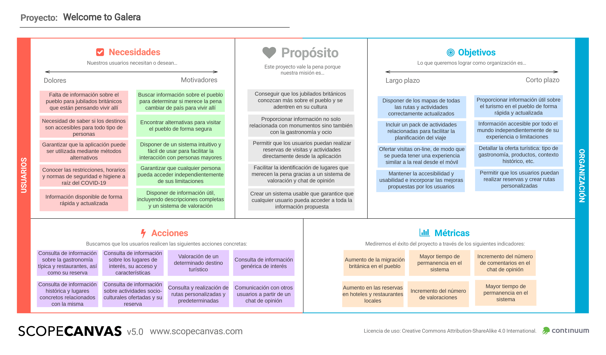

 2.c Tasks analysis 
-----
A continuación, se analizarán las principales tareas de la aplicación por medio de User/Task flows. Se ha decidido usar esta técnica debido a que, al ser una aplicación orientada a un grupo de usuarios concreto, una matriz de tareas/usuarios no reflejaría una información tan completa ya que los perfiles de usuario no son tan variados. Además, en este caso existen numerosas tareas muy relacionadas entre sí, por lo que usar este tipo de diagramas pueden proporcionar una visión más general sobre dichas dependencias.

A continuación se enumeran las principales tareas de la aplicación:

1. Consultar información de utilidad (sanidad,  consejos, normas de comportamiento, etc).
2. Consultar los principales miradores.
3. Consultar los principales paisajes naturales.
4. Consultar información sobre las pedanías.
5. Consultar los principales monumentos.
6. Consultar restaurantes o comidas típicas.
7. Consultar rutas predeterminadas.
8. Consultar lugares históricos.
9. Consultar ajustes (tamaño de letra o idioma).
10. Modificar ajustes (tamaño de letra o idioma).
11. Ver información del item turístico.
12. Ver contacto del item turístico.
13. Ver consideraciones del item turístico.
14. Obtener localización del item turístico.
15. Buscar rutas a pie.
16. Buscar rutas en bicicleta.
17. Buscar rutas en coche.
18. Abrir chat del item turístico.
19. Enviar un mensaje en un chat del item turístico.
20. Valorar item turístico.
21. Realizar una reserva en un item turístico.
22. Crear rutas personalizadas.
23. Consultar rutas personalizadas.

A partir de estar tareas, se han realizado una serie de User/Task flows que muestran los pasos a seguir para completar las tareas (Task flow) y las distintos caminos que puede tomar el usuario para alcanzarlas (User flow). Muchas de las tareas están relacionadas, por lo que para alcanzarlas se requiere la realización previa de otras. Por tanto, se ha reducido el número de diagramas a ocho, partiendo en cada uno de ellos de una tarea principal y mostrando aquellas que dependen de la misma.

**1. Consultar información de utilidad (sanidad, consejos, normas de comportamiento, etc).**

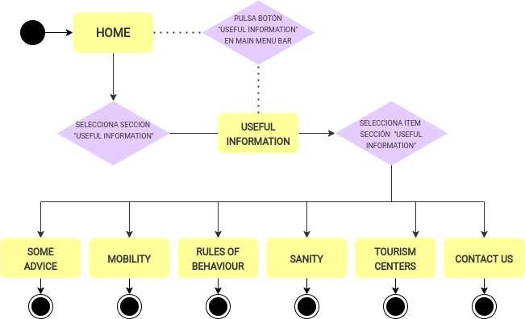

**10. Modificar ajustes (tamaño de letra o idioma).**

Indirectamente, se refleja tarea 9.

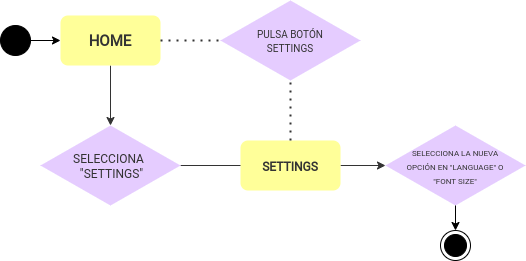

**11. Ver información de item turístico.**

Indirectamente, se reflejan tareas 2, 3, 4, 5, 6, 7, 8.

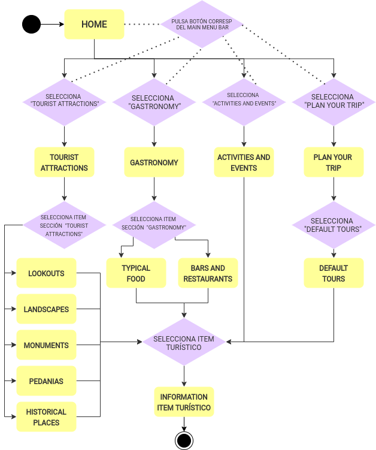

**20. Valorar item turístico.**

Indirectamente, se reflejan las tareas 12, 13, 14, 18.

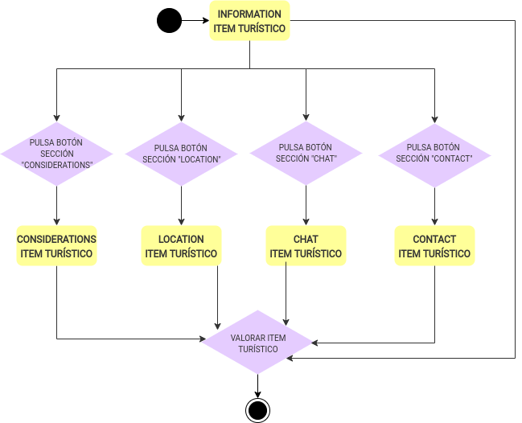

**21. Realizar una reversa en un item turístico.**

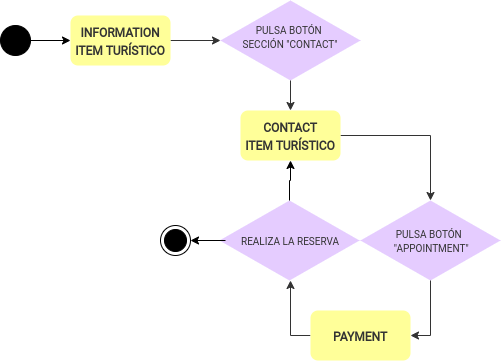

**19. Enviar un mensaje en un chat del item turístico.**

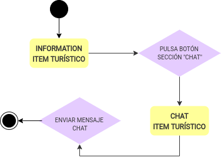

**15/16/17. Buscar rutas para llegar a un item turístico.**

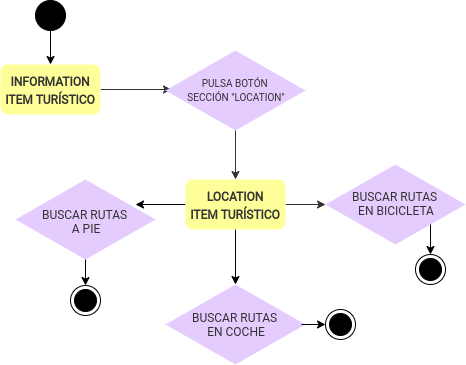

**22/23. Crear y consultar rutas personalizadas.**

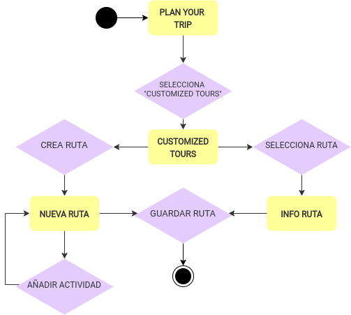

 2.d IA: Sitemap + Labelling 
----

En esta sección se incluye el mapa del sitio, que muestra las distintas vistas de la aplicación y su navegabilidad, y el labelling, que muestra los distintos elementos gráficos de la aplicación junto con su icono asociado y una breve descripción.

**Sitemap**

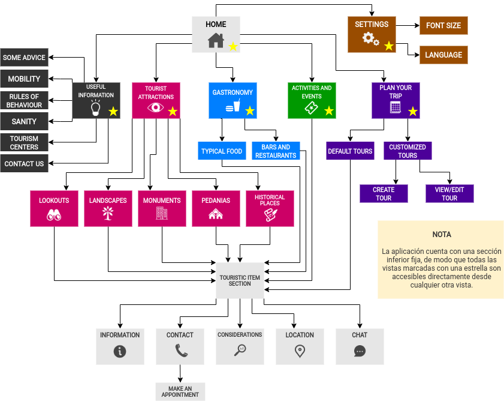

**Labelling**

 2.e Wireframes
-----

A continuación, se incluyen una serie de bocetos Lo-Fi de las distintas pantallas de la interfaz. 

Home             | Useful Information             | Settings
:-------------------------:|:-------------------------:|:-------------------------:
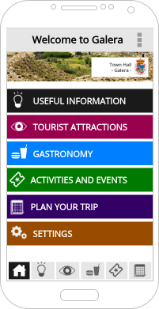  |  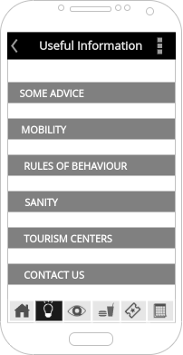 | 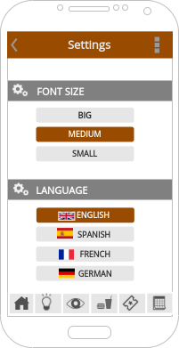 

Tourist Attractions             | Search             | Lookouts
:-------------------------:|:-------------------------:|:-------------------------:
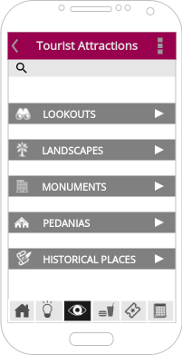  |  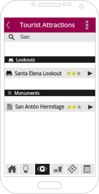 | 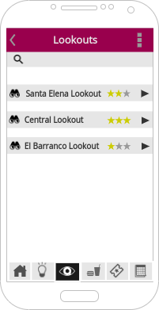 

Item Information             | Item Location             | Item Chat
:-------------------------:|:-------------------------:|:-------------------------:
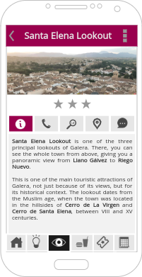  |  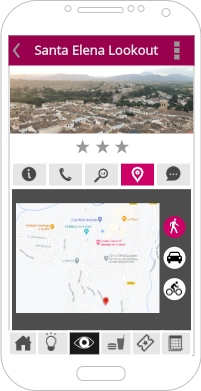 | 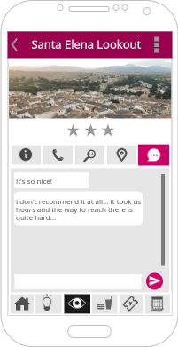 

Gastronomy             | Typical Food             | Activities and Events
:-------------------------:|:-------------------------:|:-------------------------:
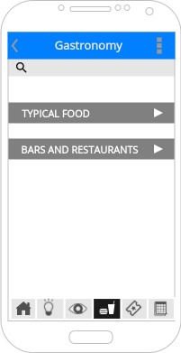  |  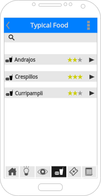 | 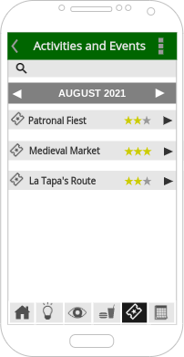 

Item Contact              | Item Payment             | Item Considerations
:-------------------------:|:-------------------------:|:-------------------------:
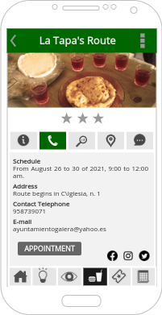  |  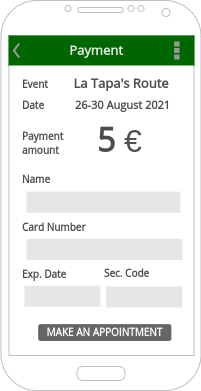 | 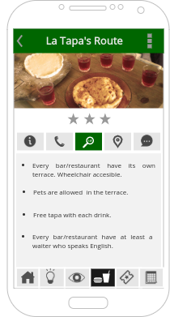 

Plan Your Trip             | Default Tours            | Default Tour Example
:-------------------------:|:-------------------------:|:-------------------------:
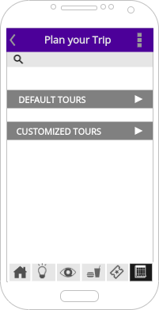  |  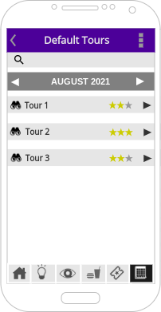 | 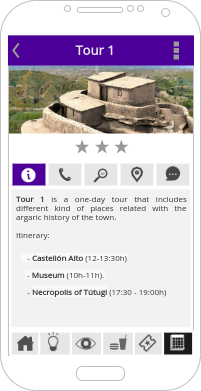 

Customized Tours             | Create New Tour             | Customized Tour Example
:-------------------------:|:-------------------------:|:-------------------------:
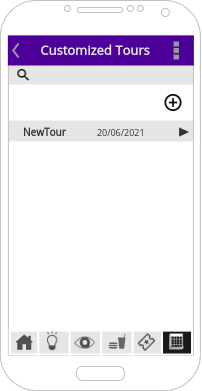  |  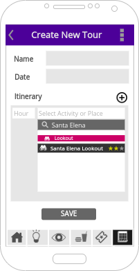 | 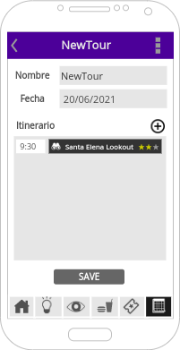 

**Navegación App**

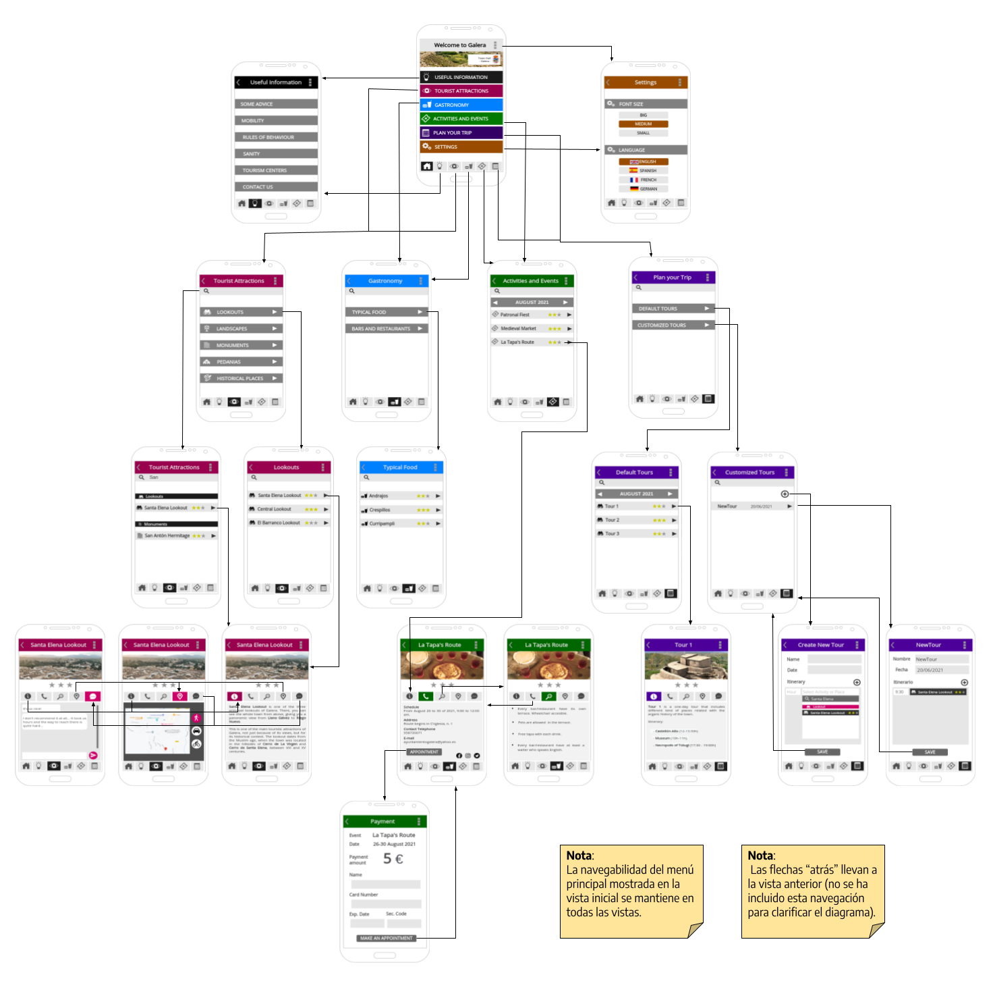
