# DIU - Practica 3

 3.a Moodboard
-----

 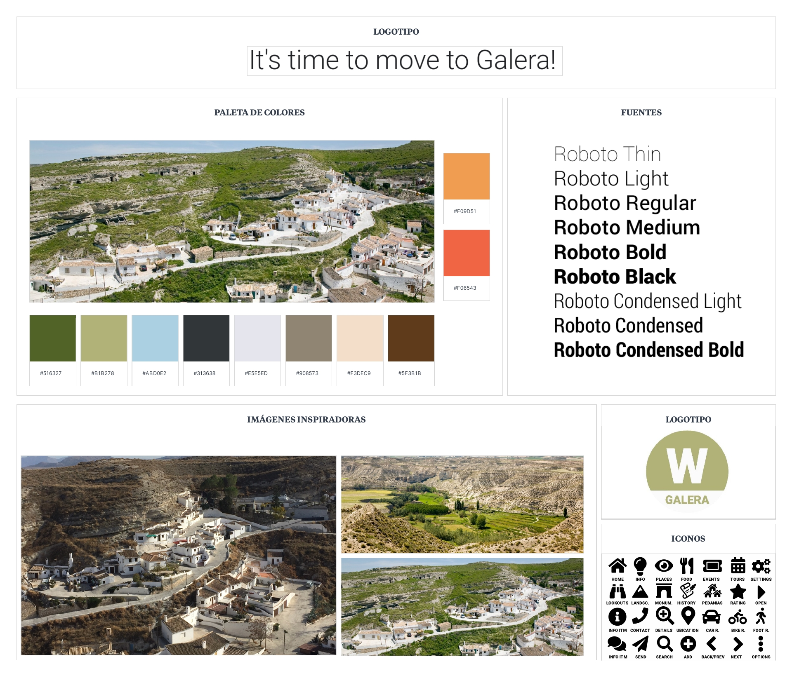

En el Moodboard se incluyen los principales elementos de diseño a considerar antes de comenzar con el bocetaje HI-FI de la aplicación, destacando: 

* **Paleta de colores** 

Se ha seleccionado esta paleta de colores ya que refleja las principales característicos del pueblo: los colores teja claros y oscuros representativos de los tradicionales tejados de las antiguas casas, los colores verdosos asociados a la vegetación típica de la zona (musgo y matorrales) y el azul que recuerda al cielo y el agua del río que atraviesa el pueblo. Además, se han añadido dos colores adicionales a la paleta (lateral derecho) con el suficiente contrase y armonía respecto a los seleccionados, orientados a servir como colores de acentuación (botones dedicados a acciones importantes).

* **Imágenes inspiradoras**

En este caso, las imágenes que han inspirado la selección de colores comentados previamente han sido imágenes de zonas muy características del pueblo. De este modo, se pretende simular con la aplicación una experiencia real que recuerde a la zona a explorar.

* **Tipo de fuente seleccionada**

Se ha seleccionado Roboto ya que, además de ser un tipo de fuente accesible y legible, resulta bastante sobria y coherente con las sensaciones que debe transmitir la aplicación: paz, armonía y tranquilidad.

* **Logotipo**

Partiendo de los colores y el tipo de fuente seleccionada, se ha creado un logotipo sencillo pero efectista, dotando a la aplicación de una imagen moderna y actual. Este logotipo se ha creado usando la herramienta Adobe Photoshop con distintas resoluciones, totalmente aplicable como imagen de cabecera de distintas redes sociales como Twitter o Facebook.

* **Iconos**

En este caso, se han reemplazado los iconos incluidos en la bocetaje inicial por otros más accesibles (aspecto comentado posteriormente en relación a las guías de estilo).

   3.b Landing Page
----

Para promocionar la aplicación, se ha bocetado una página web Onboarding con el objetivo fundamental de atraer la atención del usuario. Para ello, se ha utilizado una imagen de la zona como gráfico de refuerzo, así como una serie de testimonios que sirven de apoyo emocional para hacer que la propuesta sea deseable de cara al usuario.

 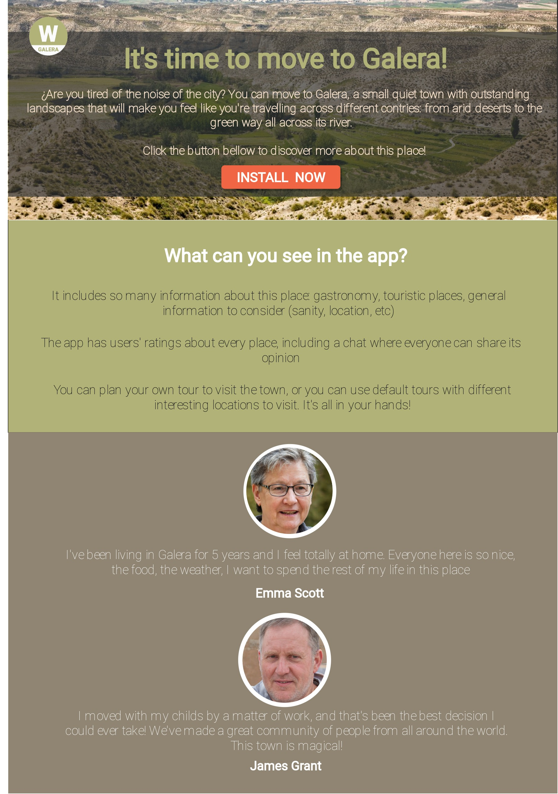

 3.c Guidelines
----

Toda la información en referencia a los patrones considerados a la hora de realizar el diseño de la aplicicación se han extradido de http://ui-patterns.com/patterns y https://mobbin.design/patterns.
    
A la hora de comentar los patrones utilizados, debemos realizar una categorización inicial según el tipo de componentes que se ven afectados:

* *Búsqueda*:
   1. **Patrón caja de búsqueda**: se ha utilizado para la búsqueda de items turísticos en las vistas principales de la aplicación para agilizar el proceso.
   2. **Patrón autocompletado**: aunque no se refleja en los bocetos, a la hora de realizar las búsqueda se incluirá la opción de autocompletado.
   
* *Navegación*:
   1. **Navegación por pestañas**: se utiliza tanto el menú del item como el menú principal (accesible desde todas las vistas). Este proporciona una forma de agrupar componentes bastante intuitiva y cómoda.
   2. **Paginación**: basado en la distribución de datos, evitando que se muestren en una sola vista. Este patrón se utiliza sobre todo en las rutas y eventos en forma de calendario, mostrando la información asociada a un mes específico.
   
* *Tareas*:
   1. **Formato estructurado**: este patrón se centra en los formularios con entrada de datos y se utiliza sobre todo en la creación y modificación de las rutas, además de para la reserva de items turísticos.

* *Otros aspectos más específicos*:
   1. **Chat**: este patrón se ha utilizado a la hora de elaborar el chat del item turístico.
   2. **Mapa**: este patrón se ha utilizado para la sección de localización del item turístico.
   3. **Calendario**: útil para la selección de fechas en la creación de rutas personalizadas.
   4. **Ajustes**: útil para la vista asociada a los ajustes del sistema, aunque personalizado al caso particular.
   5. **Valoración**: patrón utilizado para el sistema de valoración de los items turísticos.

Respecto a las guías de estilo consideradas a la hora de diseñar la aplicación, al estar orientada a dispositivos Android se han utilizado las guías de estilo Android de Google (https://material.io/develop/android). En estas guías se comentan de forma detallada todos los aspectos de diseño a considerar en este tipo de dispositivos, destacando los siguientes:
* Los iconos utilizados deben ser muy gráficos y se deben evitar detalles demasiado precisos que dificulten su compresión. Por este motivo, se han reemplazado los iconos de la práctica anterior por unos nuevos que cumplen las recomendaciones especificadas (http://fontawesome.io/).
* La aplicación cuenta con una barra de navegación inferior que permite desplazarse entre las vistas principales de la aplicación.
* Las regiones de cada vista deben diferenciarse correctamente, haciendo uso de una rejilla en el diseño para garantizar que la aplicación es responsiva.
* Todas las vistas (salvo la vista principal), deben contar con una flecha situada en la esquina superior izquierda que permita volver a la vista anterior.
* Deben cumplirse algunas medidas recomendadas a la hora de localizar los componentes en cada vista de la aplicación:
    1. Los iconos del menú inferior y de la barra de estado deben tener un tamaño de 24x24.
    2. La sección destinada a la flecha "atrás" (esquina superior izquierda) debe tener una longitud de 72 DP.
    3. Las etiquetas que acompañan a los iconos del menú inferior deben tener un tamaño de 12 DP.
    4. El menú inferior y la barra de estado deben tener una altura de 56 DP.
                
* Todos los componentes deben cumplir con el contraste suficiente como para ser distinguidos a simple vista, teniendo en cuenta la presencia de usuarios potenciales con dificultades visuales o daltonismo.
        

  3.d Mockup
----

A continuación, se incluyen una serie de bocetos Hi-Fi de las distintas pantallas de la interfaz creados a partir de Adobe XD teniendo en cuenta los patrones y guías de estilo comentadas previamente:

Home             | Useful Information             | Settings
:-------------------------:|:-------------------------:|:-------------------------:
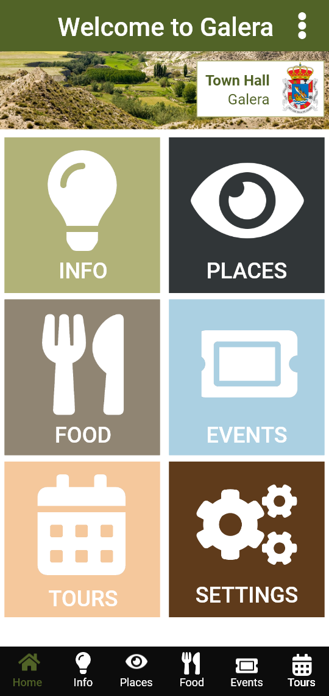  |  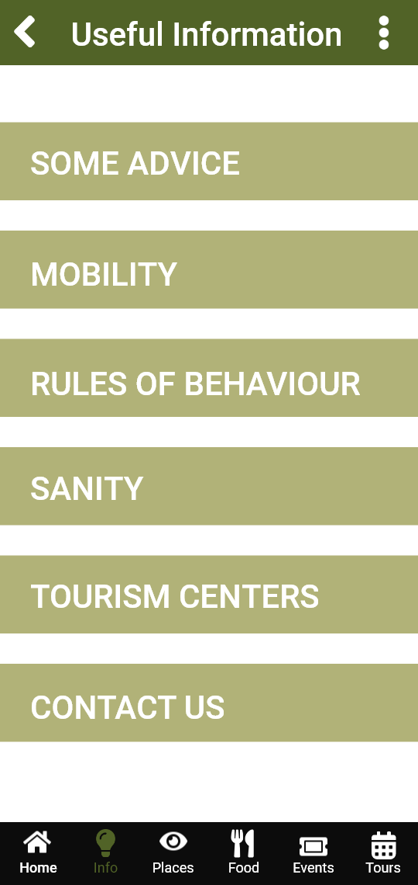 | 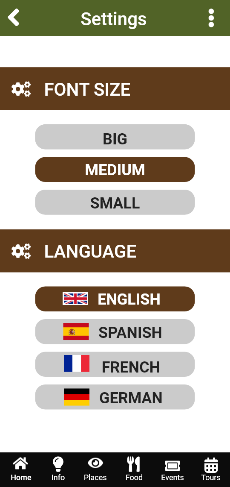 

Places             | Search             | Lookouts
:-------------------------:|:-------------------------:|:-------------------------:
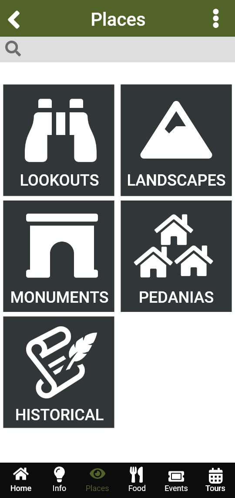  |  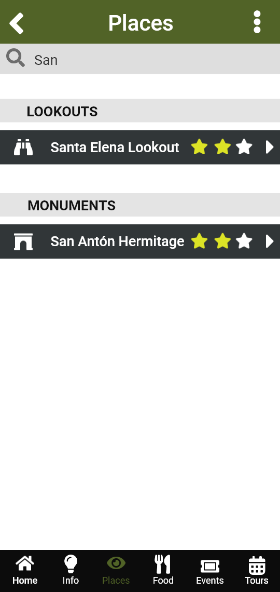 | 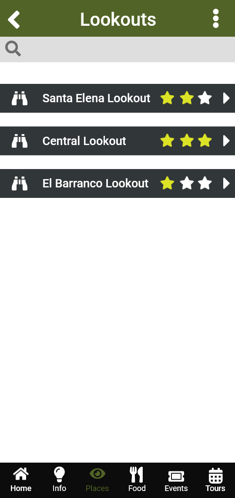 

Item Information (Place)             | Item Information (Event)           | Item Contact (Event)
:-------------------------:|:-------------------------:|:-------------------------:
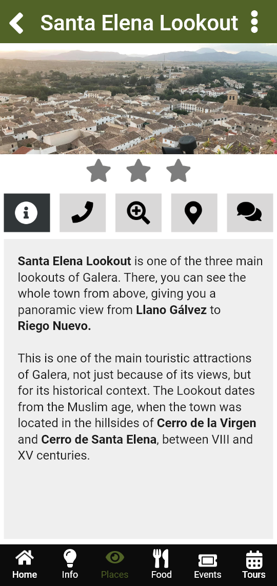  |  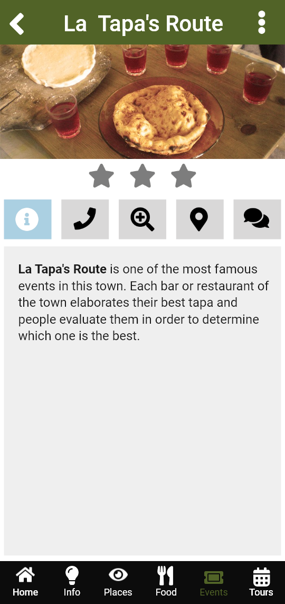 | 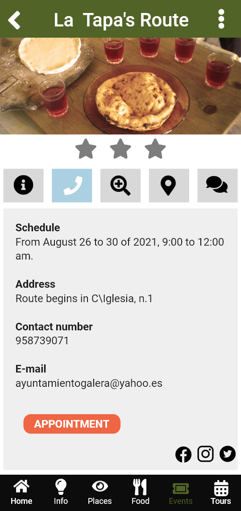 

Item Details (Event)             | Item Location (Event)            | Item Chat (Place)
:-------------------------:|:-------------------------:|:-------------------------:
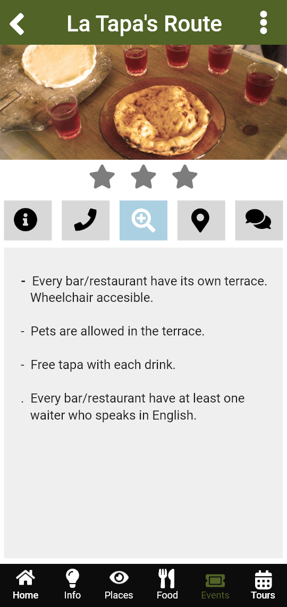  |  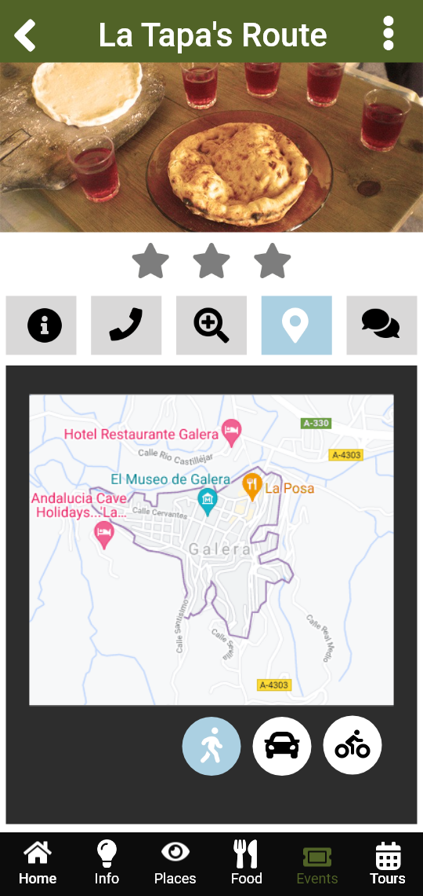 | 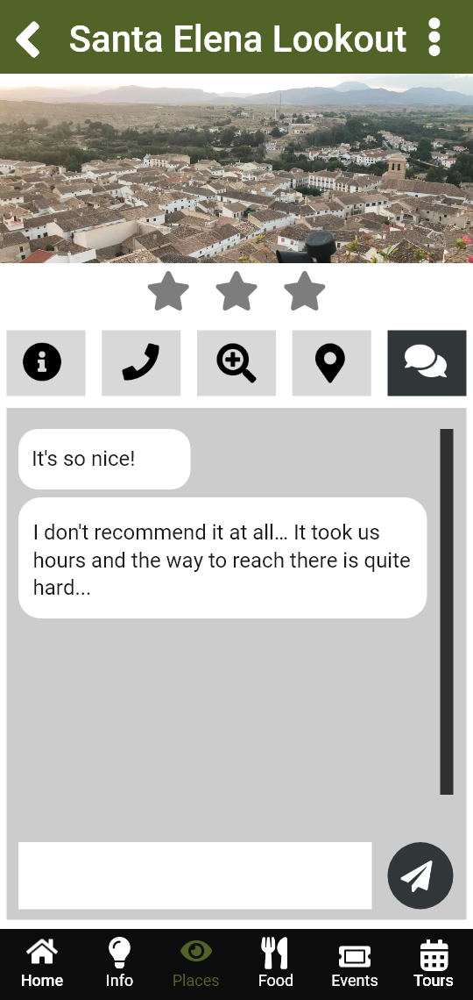 

Item Payment              | Events             | Food
:-------------------------:|:-------------------------:|:-------------------------:
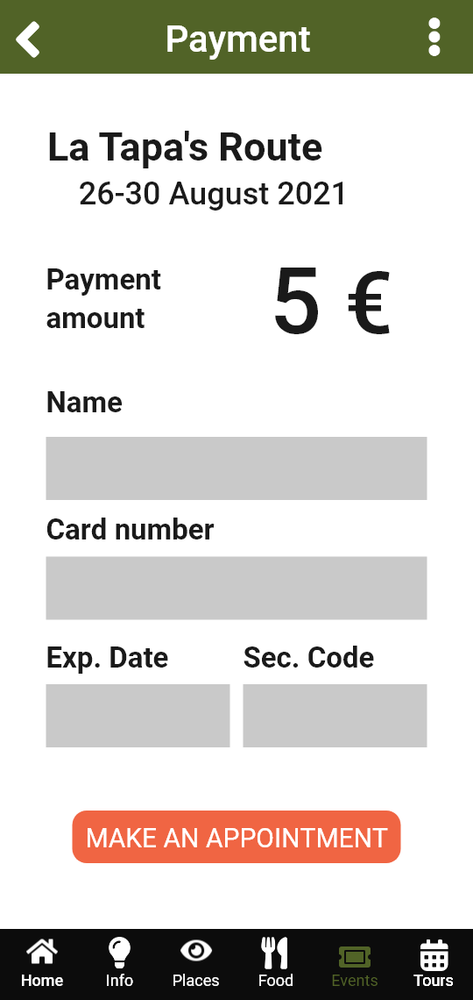  |  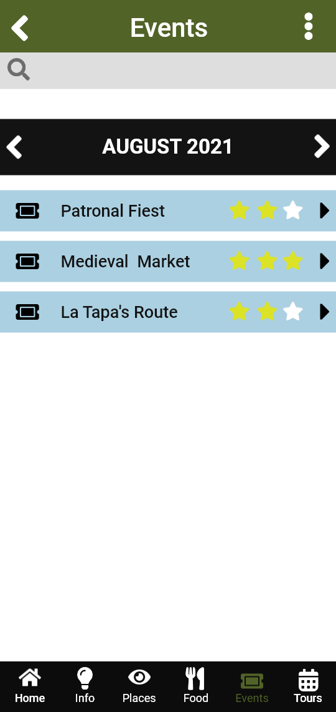 | 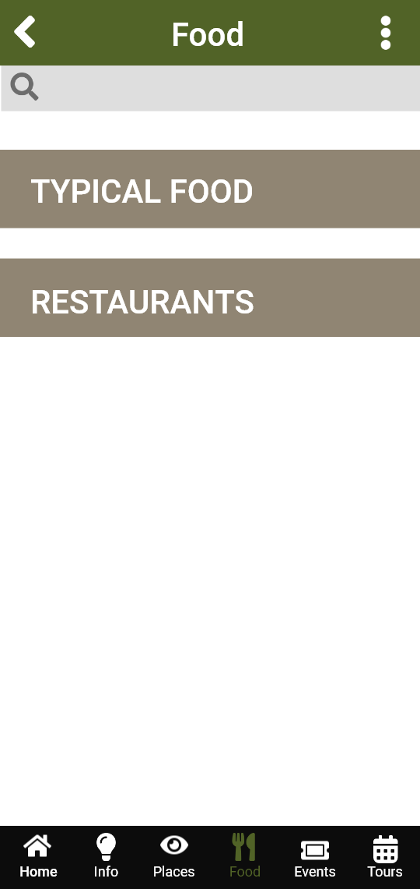 

Tours             | Typical Food         | Default Tours
:-------------------------:|:-------------------------:|:-------------------------:
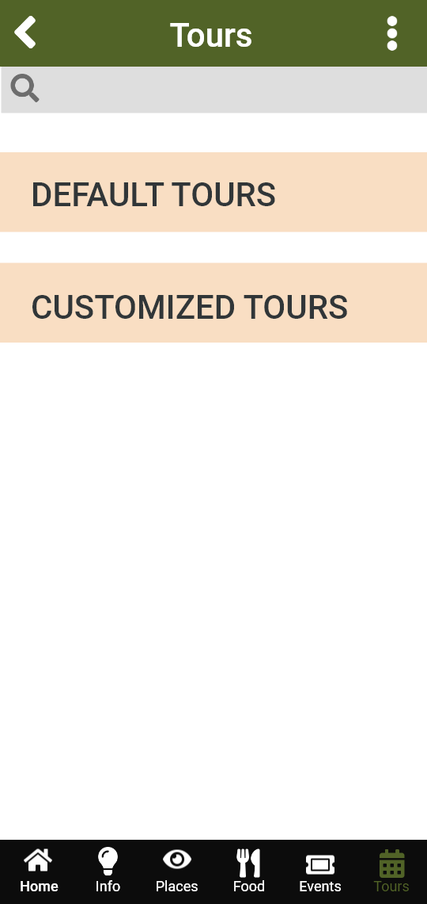  |  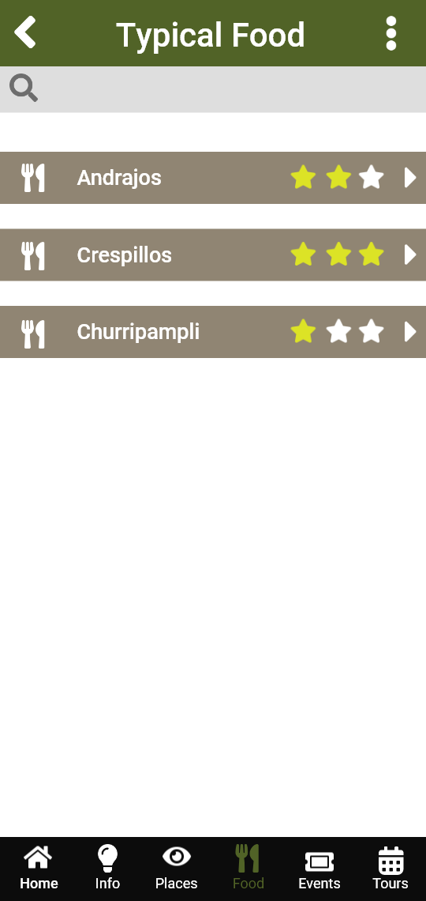 | 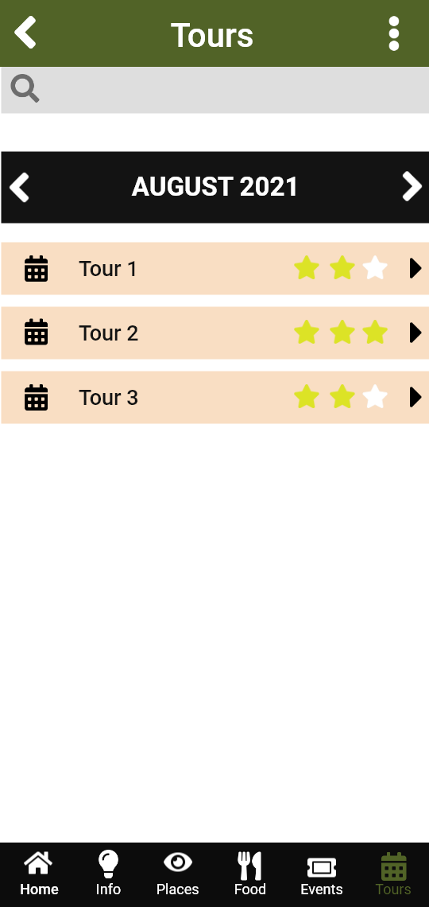 

Item Information (Tour)             | Create New Tour             | Customized Tours
:-------------------------:|:-------------------------:|:-------------------------:
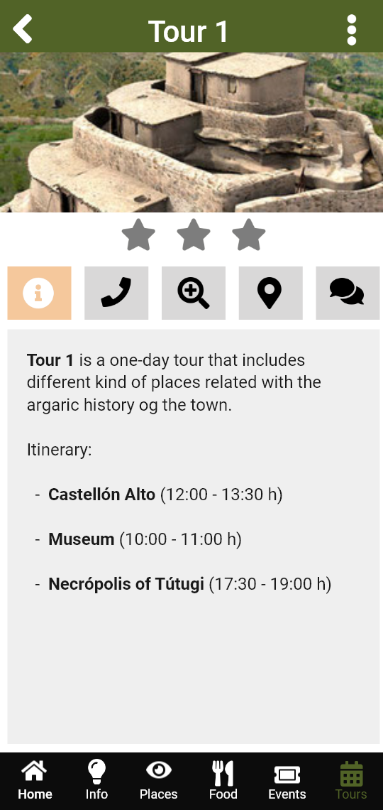  |  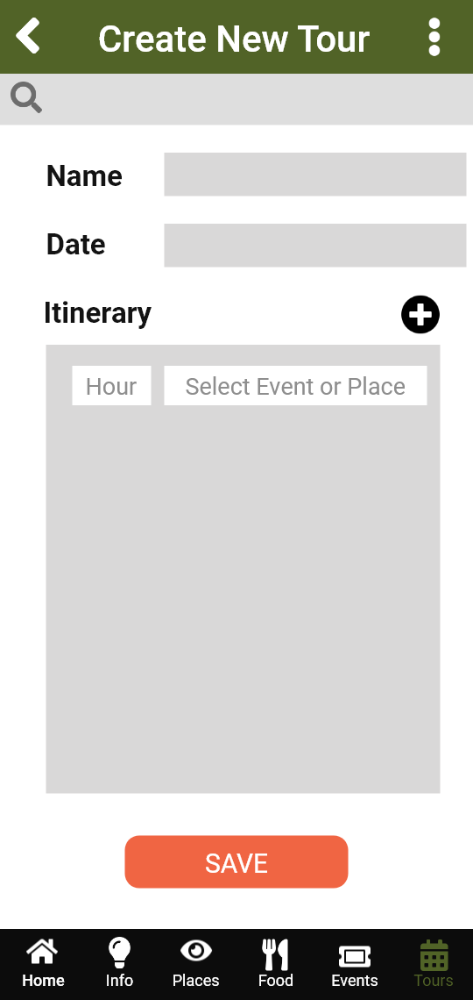 | 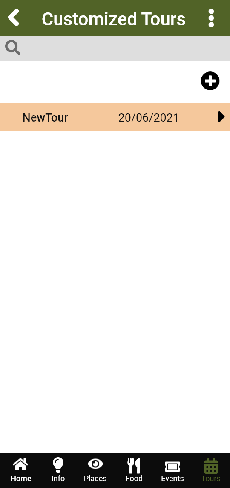 

Edit Tour  |
:-------------------------:|
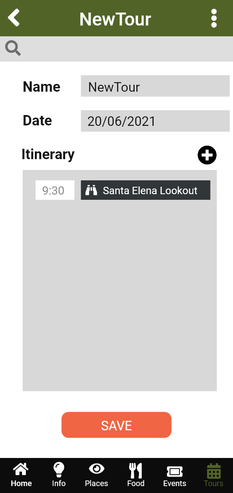

## **Demo con el funcionamiento de la app**
 
Finalmente, se incluye una demo dónde se muestra el funcionamiento de la aplicación a partir del simulador de Adobe XD. Comentar que se ha probado la aplicación en diferentes dispositivos móviles para garantizar su funcionamiento responsivo.
 
https://user-images.githubusercontent.com/48240529/116987027-d4e5c300-acce-11eb-8db2-72d9e7f3f06d.mp4

 3.e My UX-Case Study
-----

A continuación, se adjunta un breve vídeo con un resumen del proceso de diseño de la aplicación:

