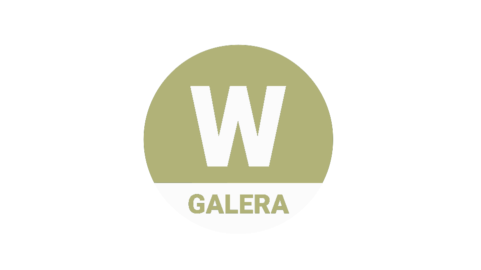
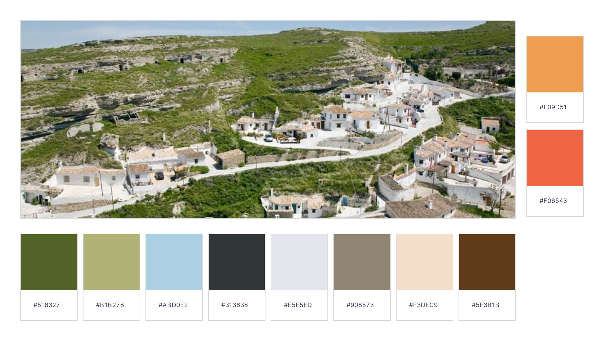
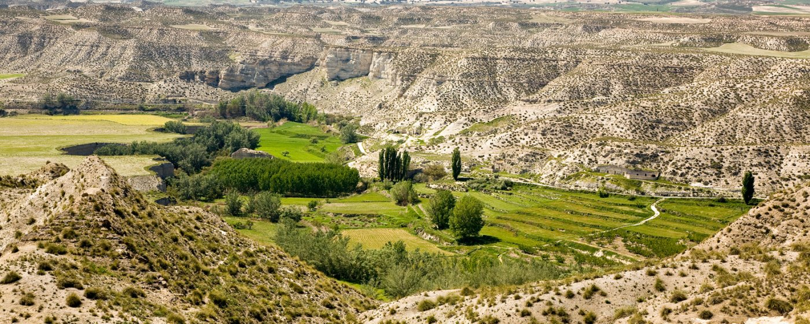
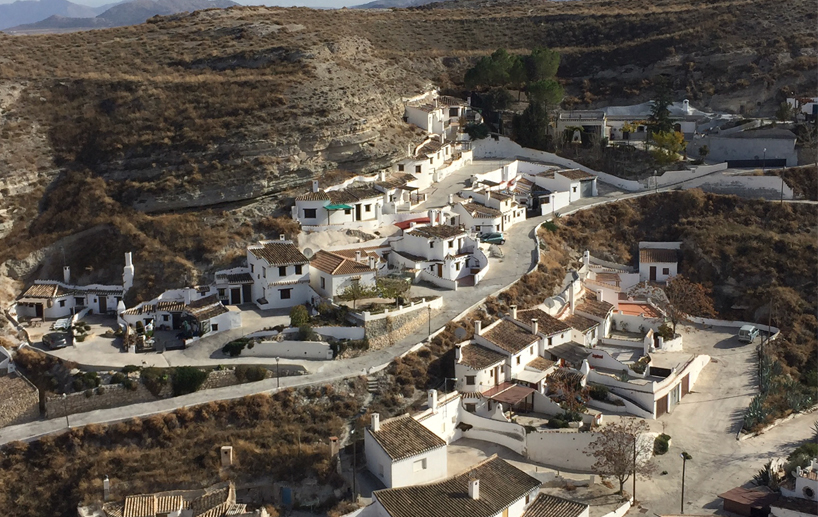
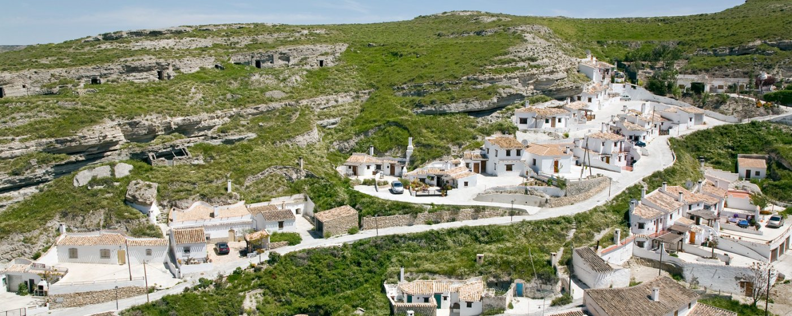

# DIU - Practica 3, entregables

## Moodboard (diseño visual + logotipo)   

### Logotipo

### Fuente seleccionada

### Paleta de colores

 Se ha seleccionado esta paleta de colores a partir de la imagen adjunta, incluyendo los colores más característicos del pueblo: los colores teja claros y oscuros representativos de los tradicionales tejados de las antiguas casas, los colores verdosos asociados a la vegetación típica de la zona (musgo y matorrales) y el azul que recuerda al cielo y el agua del río que atraviesa el pueblo. Además, se han añadido dos colores adicionales a la paleta (lateral derecho de la imagen) con el suficiente contrase y armonía respecto a los seleccionados, orientados a servir como colores de acentuación (botones dedicados a acciones importantes).

 

 
### Imágenes inspiradoras

 

 

 

## Landing Page

 

## Mockup: LAYOUT HI-FI

## Documentación: Publicación del Case Study

(incluye) Valoración del equipo sobre la realización de esta práctica o los problemas surgidos
 
