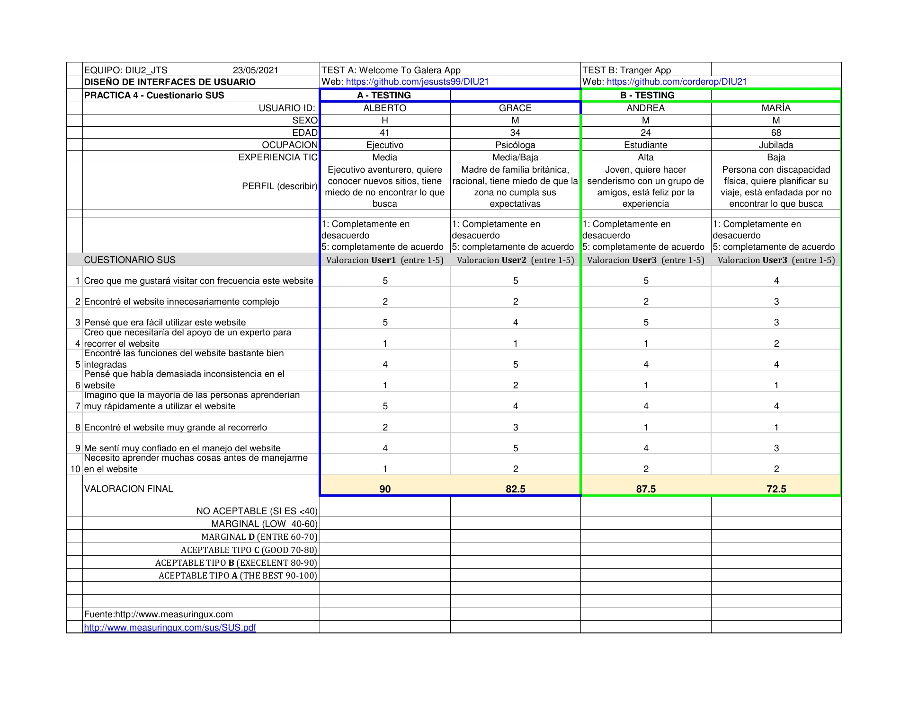

# Práctica 4

 4.a Caso asignado
----

De los dos casos asignados, se ha tomado la decisión de analizar el proyecto Tranger, perteneciente al grupo DIU1.PJ. Este proyecto se centra en el diseño de una plataforma para la creación de itinerarios de distintas temáticas, incluyendo información sobre la experiencia de los distintos usuarios, así como un guía turístico nativo que sirva como soporte adicional.

Para obtener más información sobre el proyecto, pulsa [aquí](https://github.com/corderop/DIU21).

 4.b User Testing
----

Para realizar el proceso de User Testing, se han seleccionado inicialmente 4 personas. A la hora de definir sus características, emociones y comportamientos se ha utilizado el método **role playing**. A partir de la información obtenida, se han buscado personas reales con características similares para analizar las aplicaciones propuestas:

**Usuario 1:** Alberto
   * *Tipo*: 5 (Ejecutivo)
   * *Actividad*: 3 (Disfrutar de aspectos culturales y festivos del viaje)
   * *Emoción*: 2 (Miedo)

Partiendo de esta información, se ha establecido como primer usuario a un ejecutivo que ha decidido ir de vacaciones a una zona rural con el objetivo de disfrutar al máximo de la experiencia. El principal atractivo turístico de interés para el usuario son los distintos eventos festivos ofertados en la aplicación. Sin embargo, tiene miedo de no encontrar lo que anda buscando y no poder disfrutar de estos días libres.

**Usuario 2:** Grace
   * *Tipo*: 2 (Familia)
   * *Actividad*: 2 (Procedencia extranjera)
   * *Emoción*: 2 (Miedo)

En este caso, el usuario es una madre británica que ha decidido mudarse a España con su familia, más específicamente a una zona rural dónde vivir una vida más tranquila. Después de un tiempo buscando, ha encontrado un puesto de trabajo en un centro, aunque quieren conocer más sobre la zona para saber si merece la pena. Por tanto, este usuario quiere hacer uso de la aplicación como una herramienta informativa para analizar la zona, aunque siente miedo de que la información que encuentre no cumpla sus expectativas.

**Usuario 3:** Andrea
  * *Tipo*: 3 (Miembro de un grupo de amigos)
  * *Actividad*: 6 (Le gustaría realizar una ruta de senderismo)
  * *Emoción*: 3 (Alegría)
        
Un miembro de un grupo de amigos ha decidido iniciar una ruta de senderismo, aunque no tiene ningún tipo de información sobre el tipo de rutas disponibles en la zona. De este modo, intenta documentarse a partir de la aplicación propuesta para poder disfrutar de un fin de semana con sus amigos al aire libre. El usuario se encuentra feliz y animado por esta nueva experiencia.

**Usuario 4:** María
  * *Tipo*: 4 (Usuario con discapacidad física)
  * *Actividad*: 4 (Planificar una ruta o itinerario)
  * *Emoción*: 3 (Enfado)
        
El último usuario se trata de una persona con una discapacidad física degenerativa que necesita moverse con ayuda de una silla de ruedas. Esta persona quiere planificar su itinerario, aunque siente un poco de enfado ya que ha estado intentando usar otras aplicaciones, pero en ninguna ha encontrado información útil, sobre todo en relación al tema de accesibilidad en las distintas instalaciones y actividades ofertadas.

| Usuarios | Sexo/Edad     | Ocupación   |  Exp.TIC    | Personalidad | Plataforma | Perfil | TestA/B | SUS score
| ------------- | -------- | ----------- | ----------- | -----------  | ---------- |---------- |---------- | ----
| Alberto  | H / 41   | Ejecutivo  | Media       | Extrovertido | Android       | Tipo: 5, Actividad: 3, Emoción: 2 | A | 90
| Grace  | M / 34  | Psicóloga  | Media/Baja       | Racional       | Android        | Tipo: 2, Actividad: 2, Emoción: 2      | A | 82.5
| Andrea  | M / 24   | Estudiante     | Alta        | Aventurera    | iPhone      | Tipo: 3, Actividad: 6, Emoción: 3      | B | 87.5
| María  | M / 68   | Jubilada  | Baja       | Racional     | iPhone        | Tipo: 4, Actividad: 4, Emoción: 3      | B | 72.5

. 4.c Cuestionario SUS
----
A continuación, se adjunta una imagen con los resultados obtenidos en el cuestionario SUS por cada uno de los usuarios planteados previamente:

Tal y como se puede observar en la imagen, ambas aplicaciones cuentan con resultados bastante buenos en términos de usabilidad. En ambos casos, la media está acotada por el intervalo [80-90], lo que determina un nivel de usabilidad aceptable tipo B. En general, los usuarios se sienten bastante satisfechos con las aplicaciones, transmitiendo una sensación de alegría y tranquilidad.

 4.d Usability Report
----

Finalmente, a partir de la información obtenida previamente se ha realizado un informe de Usabilidad del caso B, el cual se puede acceder pulsando [aquí](https://github.com/jesusts99/DIU21/blob/master/P4/P4_UsabReport_DIU1_PJ_doneby_DIU2_JTS.pdf).

