# DIU21
Prácticas Diseño Interfaces de Usuario 2020-21 (Tema: Turismo) 

Grupo: DIU1_01AABB.  Curso: 2020/21 
Updated: 8/2/2021

Proyecto: 
Turismo Galera

Descripción: 

Aplicación móvil orientada a usuarios extranjeros (sobre todo personas británicas jubiladas) que permite conocer más acerca de la historia, cultura y paisajes del pueblo para decidir si es el lugar idóneo para vivir o visitar.

Logotipo: 

Miembros
 * :bust_in_silhouette:   Jesús Torres Sánchez     :octocat:  

----- 

# Proceso de Diseño 

## Paso 1. UX Desk Research & Analisis 

En este caso, se ha decidido centrar la búsqueda en un sector más específico como son las aplicaciones de turismo de la ciudad de Madrid. Dentro de las aplicaciones encontradas se pueden destacar las siguientes:

**Guía Bienvenidos a Madrid: https://apps.apple.com/es/app/gu%C3%ADa-bienvenidos-a-madrid/id632497903**

Esta aplicación fue creada por la Oficina de Turismo del Ayuntamiento de Madrid con el objetivo de recoger la información esencial para que cualquier turista pudiese preparar su viaje: zonas de interés, restaurantes, actividades de ocio, etc. 

**Paseo del Arte Imprescindible: https://www.esmadrid.com/app-paseo-arte-imprescindible**
    
Se trata de una aplicación dónde se recogen todas las obras de arte del Museo del Prado, el Museo Thyssen-Bornemisza y el Museo Reina Sofía. Gracias a esta app, los usuarios podrán conocer en profundidad las obras de forma amena y sencilla.

**Guía Madrid 5D: https://play.google.com/store/apps/details?id=com.jgdelval.rutando.madrid5d**

Esta aplicación recoge los principales atractivos turísticos de Madrid de una forma bastante atractiva e interactiva. Contiene una gran cantidad de rutas autoguiadas y además permite crear rutas personalizadas de forma fácil e intuitiva.

**MSE & Tax Free: https://play.google.com/store/apps/details?id=es.equmedia.Madiva&hl=es_419**

La aplicación permite a los usuarios encontrar numerosas tiendas, servicios y actividades en Madrid para poder planificar tu viaje. En ella se incluyen descripciones completas de cada servicio ofrecido.

**Madrid Turismo: https://play.google.com/store/apps/details?id=turpromadrid.principal&hl=es&gl=US**
	
Se trata de una aplicación muy completa destinada al Turismo en Madrid. Permite llevar un control de los lugares turísticos ya visitados, así como identificar que monumentos están cerca de tu zona actual.

A continuación, se incluye una tabla con una análisis competitivo de las distintas aplicaciones:

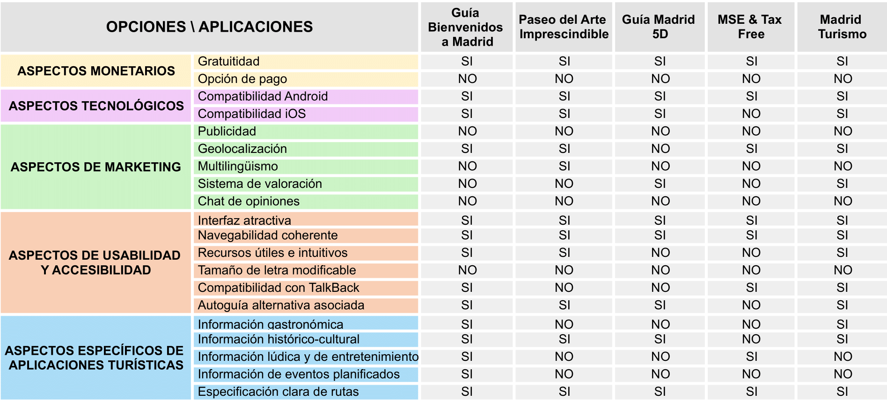

Partiendo de la comparativa anterior, la aplicación finalmente seleccionada ha sido "Guía Bienvenidos a Madrid".

 1.b Persona
-----

La primera persona seleccionada ha sido Dolores, una mujer jubilada con poca experiencia en el tema de las tecnologías y que no conoce a ninguna persona en su entorno cercano que pueda ayudarla. Sin embargo, es una persona capaz, por lo que decide comprarse un teléfono móvil e investigar por su cuenta para realizar una visita a la ciudad.

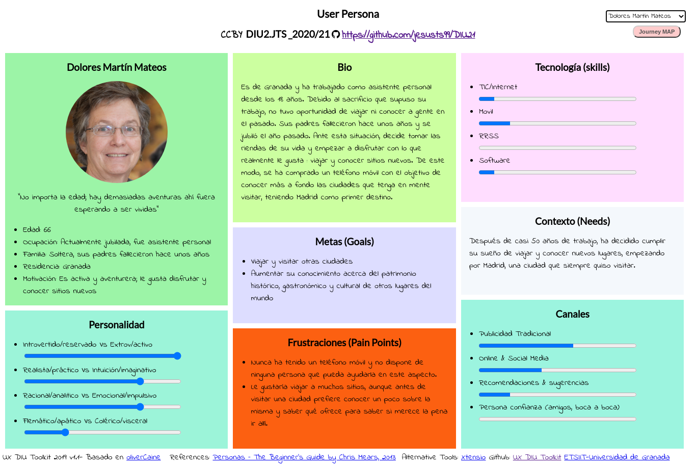

La segunda persona seleccionada ha sido Alejandro, un joven con dificultades motrices y visuales que vive en un pueblo y ha pensado en independizarse, por lo que le gustaría conocer qué sitios puede visitar para decidirse finalmente por la capital o buscar otra alternativa.

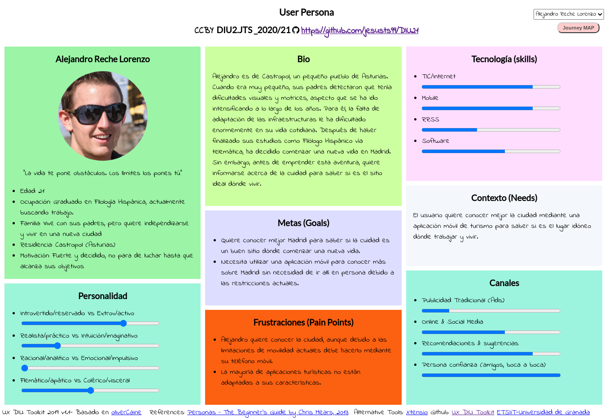

 1.c User Journey Map
----
La primera experiencia se basa en la búsqueda por parte de Dolores de toda la información posible para planificar su viaje a Madrid en la próxima semana. He seleccionado esta experiencia ya que, a pesar de que puede parecer común, no se le presta demasiada atención a la interacción de personas sin experiencia que no disponen de ningún tipo de ayuda externa a la hora de manejar las aplicaciones de su dispositivo móvil.

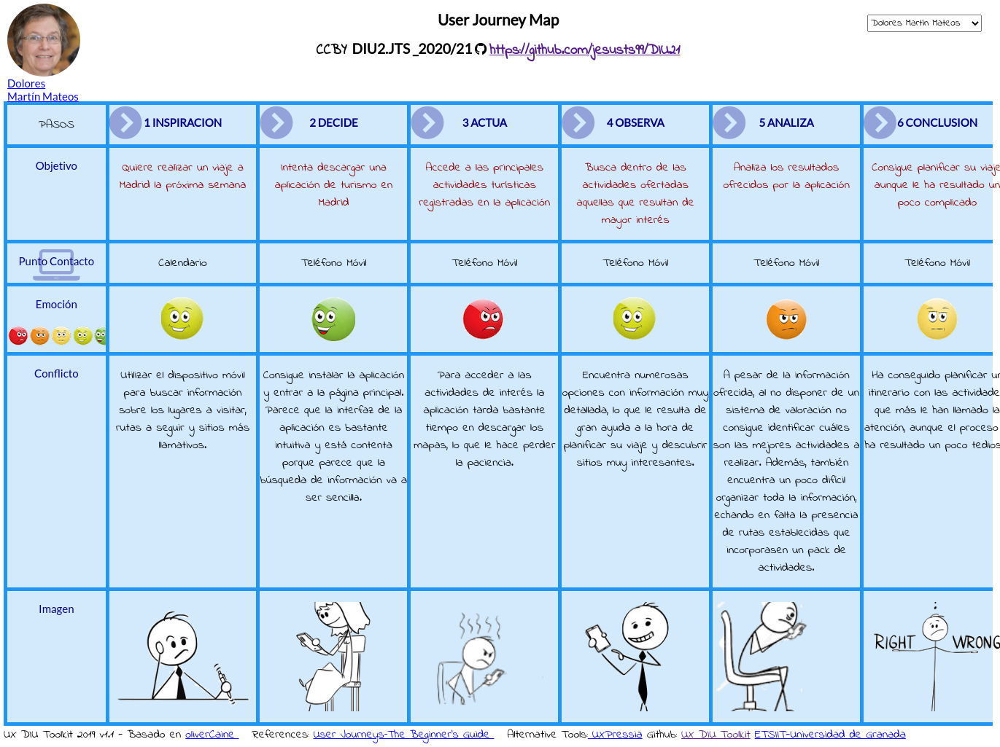

La segunda experiencia se basa en la investigación de Alejandro para conocer más sitios e información de Madrid con el objetivo de decidir si finalmente es un sitio apto para vivir y trabajar. He seleccionado esta experiencia ya que todavía existen numerosas aplicaciones que no consideran la existencia de personas que necesitan acceder al contenido mediante métodos alternativos a los tradicionales.

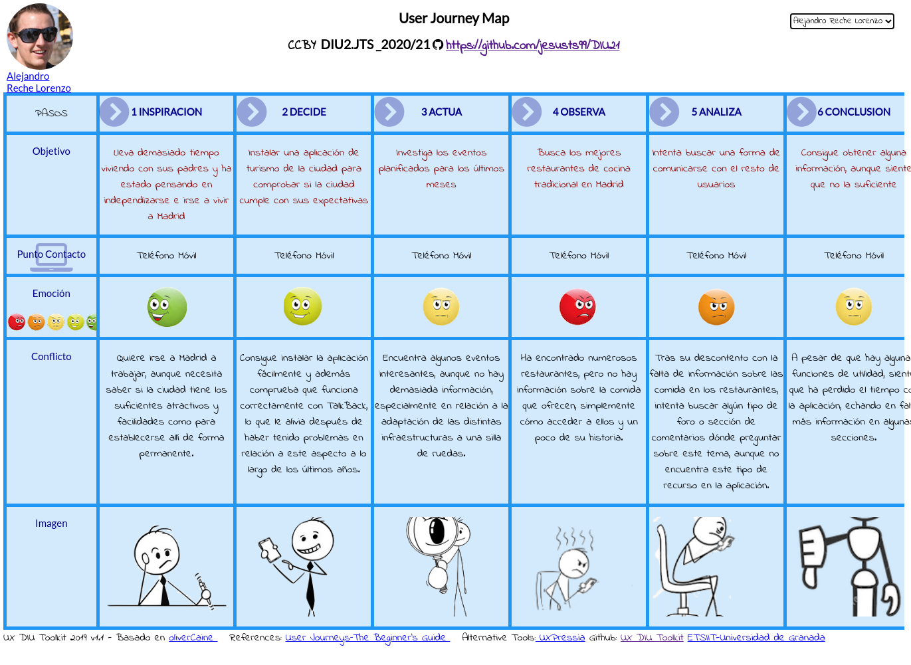

 1.d Usability Review
----

>>> Para acceder al documento con la Revisión de Usabilidad de la aplicación, [pulse aquí](https://github.com/jesusts99/DIU21/blob/master/P1/UsabilityReview.pdf)

>>> Valoración final (numérica): 63 (Moderate)

Sobre esta valoración, comentar que existen numerosos aspectos bastante mejorables, sobre todo en relación al sistema de búsquedas, navegabilidad y ayudas propuestas. Sin embargo, la aplicación presenta una interfaz bastante sencilla e intuitiva y la información ofrecida resulta de utilidad.

## Paso 2. UX Design  

 2.a Feedback Capture Grid
----

En este caso, se ha decidido utilizar una malla receptora de información o feedback capture grid a la hora de realizar la propuesta de diseño, sirviendo como método de análisis del estudio realizado en la práctica anterior. De este modo, y aunque la aplicación a desarrollar esté orientada al turismo en la provincia de Granada, las ideas y defectos de la aplicación revisada en la práctica 1 son totalmente extrapolables a la actual. Así, teniendo en cuenta la experiencia de los usuarios ficticios, análisis competitivo y revisión de usabilidad de la aplicación Guía Bienvenidos a Madrid, se han obtenido las siguientes conclusiones:

 Interesante | Críticas     
| ------------- | -------
El menú principal es sencillo y está bien organizado en categorías importantes. | Las opciones de búsqueda son muy limitadas y poco intuitivas.
La aplicación es compatible con TalkBack. | La aplicación solamente está disponible en español.
La información de la aplicación resulta clara e intuitiva, evitando contenido tedioso que dificulte la experiencia de usuario. | Existe una sección en el menú principal dónde se agrupan características demasiados genéricas y con poca relación.
Cada actividad o lugar dispone de un mapa con indicaciones claras sobre cómo llegar al mismo. | Tiempo excesivo a la hora de descargar los mapas.

  Preguntas | Nuevas ideas
| ------------- | -------
¿Qué gastronomía ofrecen los restaurantes mostrados en la aplicación? | Disponer de un chat para poder compartir opiniones con otros usuarios.
¿Qué características tienen las instalaciones que muestra la aplicación? ¿Disponen de medidas para personas con limitaciones físicas, visuales o auditivas? | Permitir que la aplicación esté disponible en varios idiomas para turistas que no entiendan el castellano.
¿Se puede modificar el tamaño de letra? | Incluir un sistema de valoración para poder identificar rápidamente los lugares más atractivos.
¿Hay alguna forma de acceder a rutas ya creadas que incluyan un grupo de destinos relacionados? | Disponer de una sección de de información útil clara y organizada.

  
Una vez analizados todos estos aspectos, se propone realizar una aplicación que incorpore las ideas comentadas previamente y solucione los aspectos a mejorar del caso revisado. Esta aplicación se centrará en el turismo en Galera, un pequeño pueblo de la provincia de Granada. Sin embargo, en este caso no se tratará simplemente de una aplicación turística, sino que estará orientada al colectivo de personas jubiladas británicas que quieren visitar el pueblo y que están pensando en mudarse allí. 

De este modo, además de la típica información relacionada con monumentos o gastronomía, se incorporarán recursos acerca de las pedanías, actividades y eventos tradicionales del pueblo para que dicho colectivo se integre más en la cultura local. Además, se incorporarán una serie de medidas muy importantes: se permitirá la reserva de actividades desde la propia aplicación, se incluirá un chat para comunicarse con otros usuarios y se contará con un sistema de valoración para saber cuáles son los lugares más llamativos para los turistas.

 2.b ScopeCanvas
----

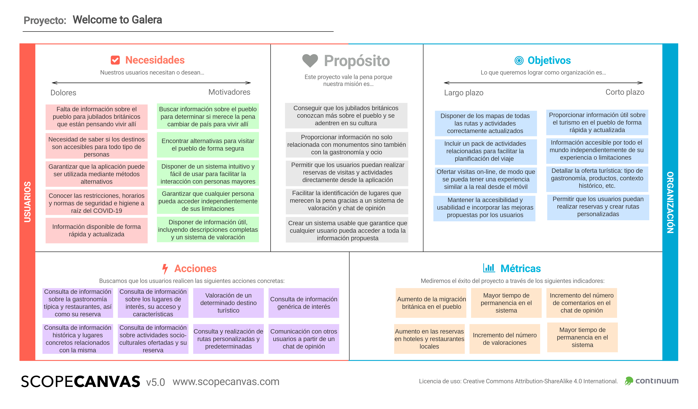

 2.c Tasks analysis 
-----
A continuación, se analizarán las principales tareas de la aplicación por medio de User/Task flows. Se ha decidido usar esta técnica debido a que, al ser una aplicación orientada a un grupo de usuarios concreto, una matriz de tareas/usuarios no reflejaría una información tan completa ya que los perfiles de usuario no son tan variados. Además, en este caso existen numerosas tareas muy relacionadas entre sí, por lo que usar este tipo de diagramas pueden proporcionar una visión más general sobre dichas dependencias.

A continuación se enumeran las principales tareas de la aplicación:

1. Consultar información de utilidad (sanidad,  consejos, normas de comportamiento, etc).
2. Consultar los principales miradores.
3. Consultar los principales paisajes naturales.
4. Consultar información sobre las pedanías.
5. Consultar los principales monumentos.
6. Consultar restaurantes o comidas típicas.
7. Consultar rutas predeterminadas.
8. Consultar lugares históricos.
9. Consultar ajustes (tamaño de letra o idioma).
10. Modificar ajustes (tamaño de letra o idioma).
11. Ver información del item turístico.
12. Ver contacto del item turístico.
13. Ver consideraciones del item turístico.
14. Obtener localización del item turístico.
15. Buscar rutas a pie.
16. Buscar rutas en bicicleta.
17. Buscar rutas en coche.
18. Abrir chat del item turístico.
19. Enviar un mensaje en un chat del item turístico.
20. Valorar item turístico.
21. Realizar una reserva en un item turístico.
22. Crear rutas personalizadas.
23. Consultar rutas personalizadas.

A partir de estar tareas, se han realizado una serie de User/Task flows que muestran los pasos a seguir para completar las tareas (Task flow) y las distintos caminos que puede tomar el usuario para alcanzarlas (User flow). Muchas de las tareas están relacionadas, por lo que para alcanzarlas se requiere la realización previa de otras. Por tanto, se ha reducido el número de diagramas a ocho, partiendo en cada uno de ellos de una tarea principal y mostrando aquellas que dependen de la misma.

**1. Consultar información de utilidad (sanidad, consejos, normas de comportamiento, etc).**

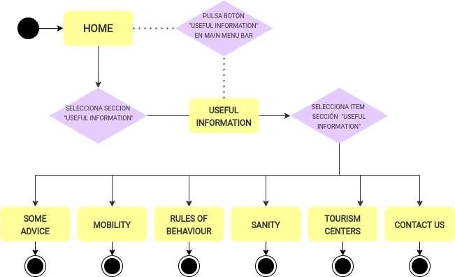

**10. Modificar ajustes (tamaño de letra o idioma).**

Indirectamente, se refleja tarea 9.

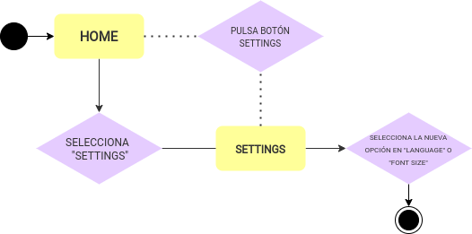

**11. Ver información de item turístico.**

Indirectamente, se reflejan tareas 2, 3, 4, 5, 6, 7, 8.

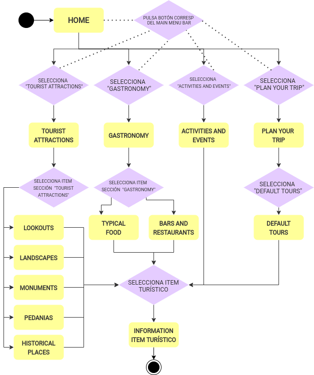

**20. Valorar item turístico.**

Indirectamente, se reflejan las tareas 12, 13, 14, 18.

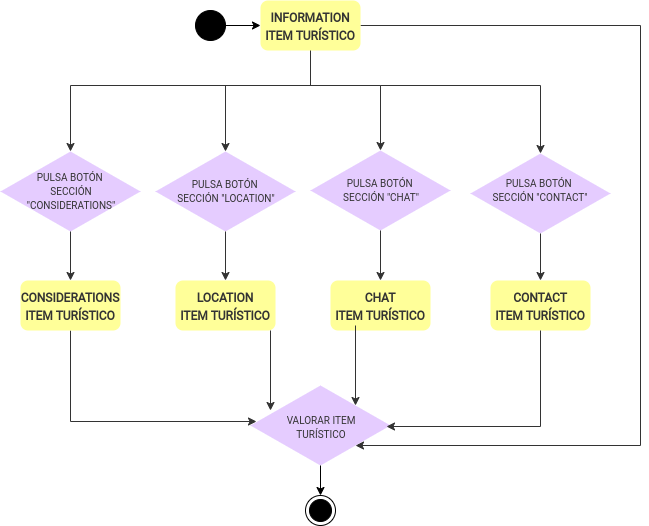

**21. Realizar una reversa en un item turístico.**

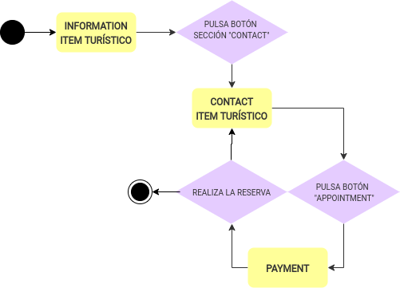

**19. Enviar un mensaje en un chat del item turístico.**

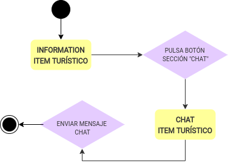

**15/16/17. Buscar rutas para llegar a un item turístico.**

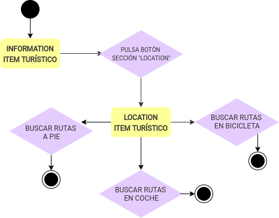

**22/23. Crear y consultar rutas personalizadas.**

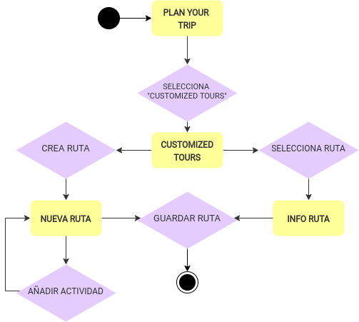

 2.d IA: Sitemap + Labelling 
----

En esta sección se incluye el mapa del sitio, que muestra las distintas vistas de la aplicación y su navegabilidad, y el labelling, que muestra los distintos elementos gráficos de la aplicación junto con su icono asociado y una breve descripción.

**Sitemap**

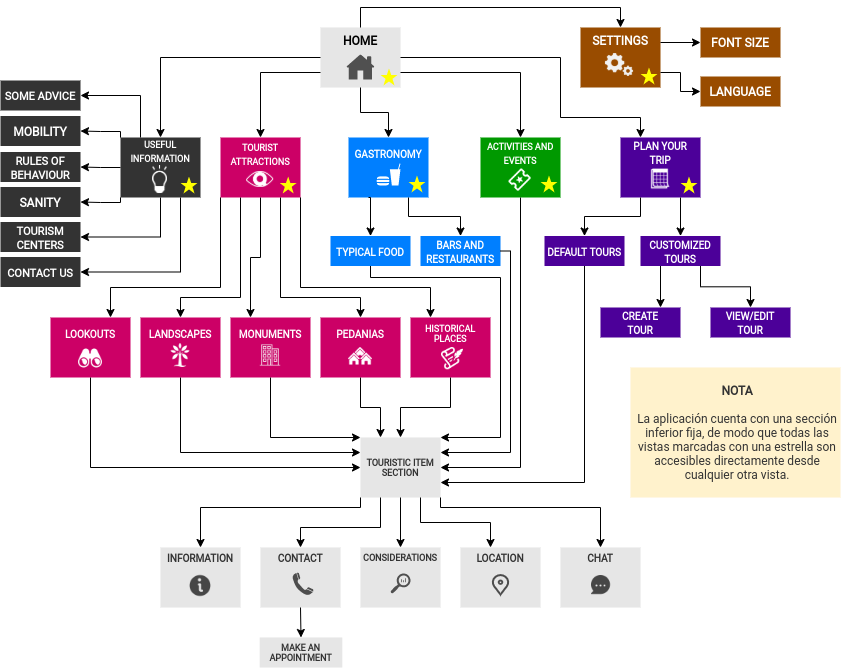

**Labelling**

 2.e Wireframes
-----

A continuación, se incluyen una serie de bocetos Lo-Fi de las distintas pantallas de la interfaz. 

Home             | Useful Information             | Settings
:-------------------------:|:-------------------------:|:-------------------------:
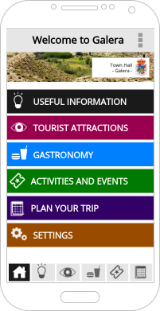  |  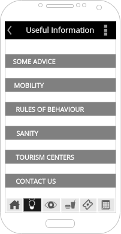 | 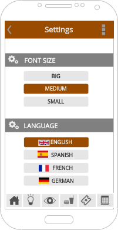 

Tourist Attractions             | Search             | Lookouts
:-------------------------:|:-------------------------:|:-------------------------:
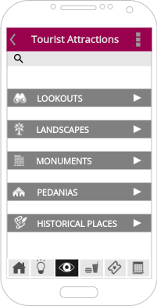  |  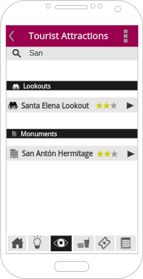 | 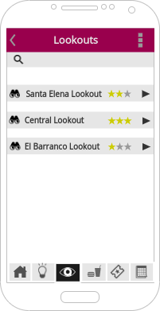 

Item Information             | Item Location             | Item Chat
:-------------------------:|:-------------------------:|:-------------------------:
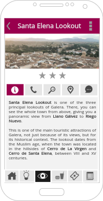  |  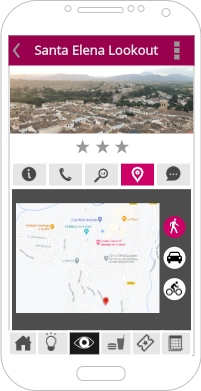 | 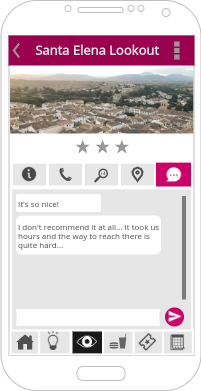 

Gastronomy             | Typical Food             | Activities and Events
:-------------------------:|:-------------------------:|:-------------------------:
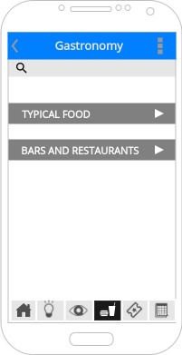  |  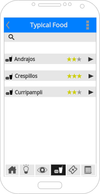 | 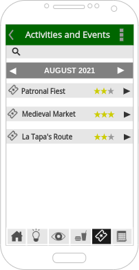 

Item Contact              | Item Payment             | Item Considerations
:-------------------------:|:-------------------------:|:-------------------------:
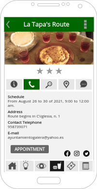  |  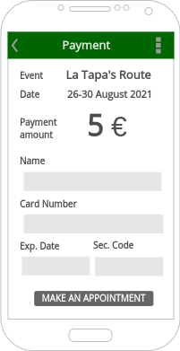 | 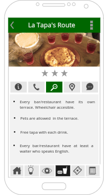 

Plan Your Trip             | Default Tours            | Default Tour Example
:-------------------------:|:-------------------------:|:-------------------------:
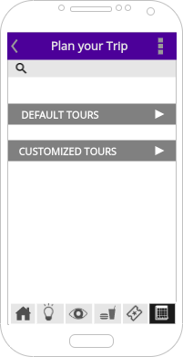  |  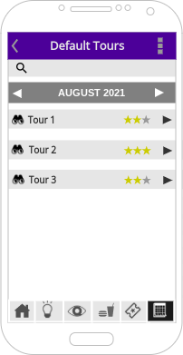 | 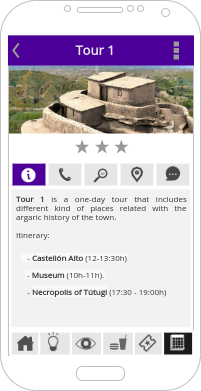 

Customized Tours             | Create New Tour             | Customized Tour Example
:-------------------------:|:-------------------------:|:-------------------------:
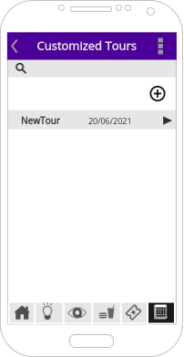  |  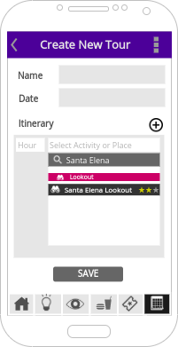 | 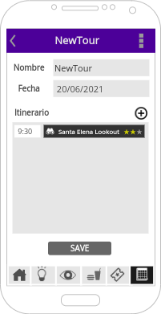 

**Navegación App**

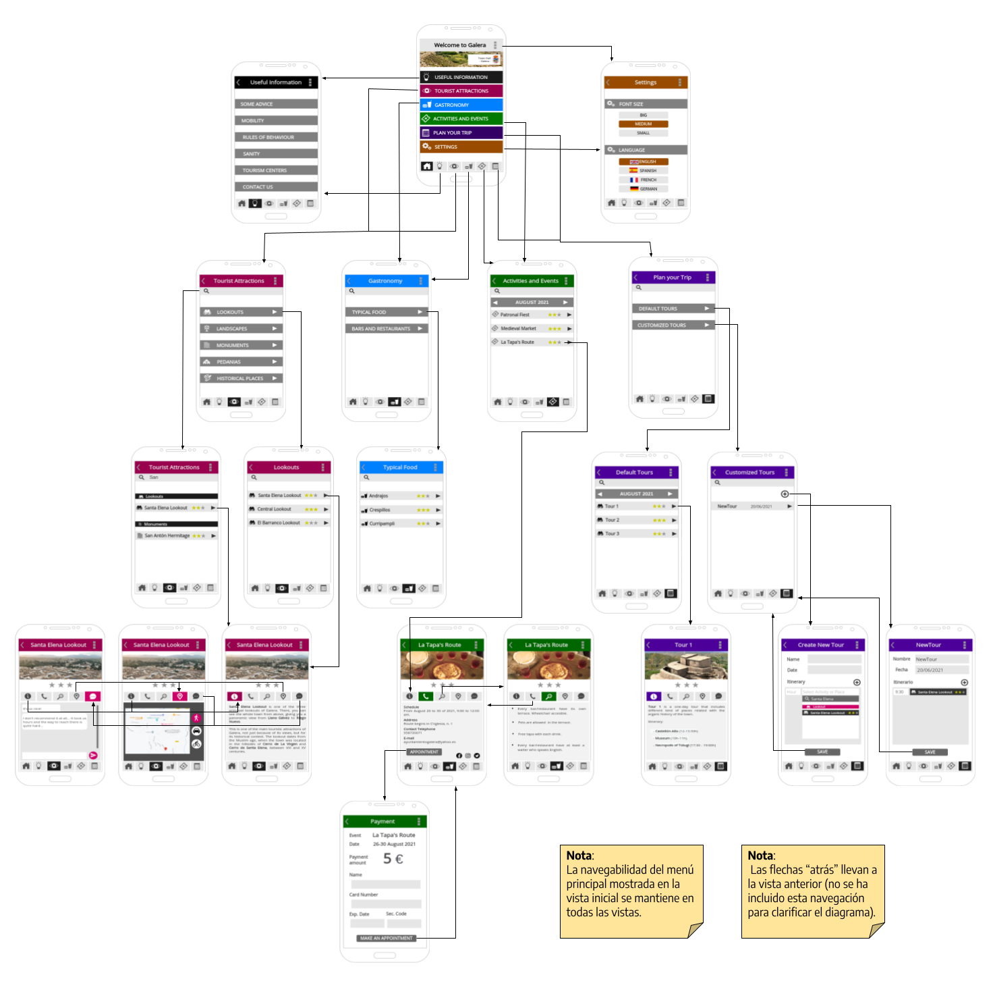

## Paso 3. Mi UX-Case Study (diseño)

 3.a Moodboard
-----

>>> Plantear Diseño visual con una guía de estilos visual (moodboard) 
>>> Incluir Logotipo
>>> Si diseña un logotipo, explique la herramienta utilizada y la resolución empleada. ¿Puede usar esta imagen como cabecera de Twitter, por ejemplo, o necesita otra?

  3.b Landing Page
----

>>> Plantear Landing Page 

 3.c Guidelines
----

>>> Estudio de Guidelines y Patrones IU a usar 
>>> Tras documentarse, muestre las deciones tomadas sobre Patrones IU a usar para la fase siguiente de prototipado. 

  3.d Mockup
----

>>> Layout: Mockup / prototipo HTML  (que permita simular tareas con estilo de IU seleccionado)

 3.e ¿My UX-Case Study?
-----

>>> Publicar my Case Study en Github..
>>> Documente y resuma el diseño de su producto en forma de video de 90 segundos aprox

## Paso 4. Evaluación 

 4.a Caso asignado
----

>>> Breve descripción del caso asignado con enlace a  su repositorio Github

 4.b User Testing
----

>>> Seleccione 4 personas ficticias. Exprese las ideas de posibles situaciones conflictivas de esa persona en las propuestas evaluadas. Asigne dos a Caso A y 2 al caso B
 

| Usuarios | Sexo/Edad     | Ocupación   |  Exp.TIC    | Personalidad | Plataforma | TestA/B
| ------------- | -------- | ----------- | ----------- | -----------  | ---------- | ----
| User1's name  | H / 18   | Estudiante  | Media       | Introvertido | Web.       | A 
| User2's name  | H / 18   | Estudiante  | Media       | Timido       | Web        | A 
| User3's name  | M / 35   | Abogado     | Baja        | Emocional    | móvil      | B 
| User4's name  | H / 18   | Estudiante  | Media       | Racional     | Web        | B 

. 4.c Cuestionario SUS
----

>>> Usaremos el **Cuestionario SUS** para valorar la satisfacción de cada usuario con el diseño (A/B) realizado. Para ello usamos la [hoja de cálculo](https://github.com/mgea/DIU19/blob/master/Cuestionario%20SUS%20DIU.xlsx) para calcular resultados sigiendo las pautas para usar la escala SUS e interpretar los resultados
http://usabilitygeek.com/how-to-use-the-system-usability-scale-sus-to-evaluate-the-usability-of-your-website/)
Para más información, consultar aquí sobre la [metodología SUS](https://cui.unige.ch/isi/icle-wiki/_media/ipm:test-suschapt.pdf)

>>> Adjuntar captura de imagen con los resultados + Valoración personal 

 4.d Usability Report
----

>> Añadir report de usabilidad para práctica B (la de los compañeros)

>>> Valoración personal 

## Paso 5. Evaluación de Accesibilidad  

  5.a Accesibility evaluation Report 
----

>>> Indica qué pretendes evaluar (de accesibilidad) sobre qué APP y qué resultados has obtenido 

>>> 5.a) Evaluación de la Accesibilidad (con simuladores o verificación de WACG) 
>>> 5.b) Uso de simuladores de accesibilidad 

>>> (uso de tabla de datos, indicar herramientas usadas) 

>>> 5.c Breve resumen del estudio de accesibilidad (de práctica 1) y puntos fuertes y de mejora de los criterios de accesibilidad de tu diseño propuesto en Práctica 4.

## Conclusión final / Valoración de las prácticas

>>> (90-150 palabras) Opinión del proceso de desarrollo de diseño siguiendo metodología UX y valoración (positiva /negativa) de los resultados obtenidos  

